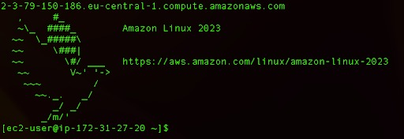
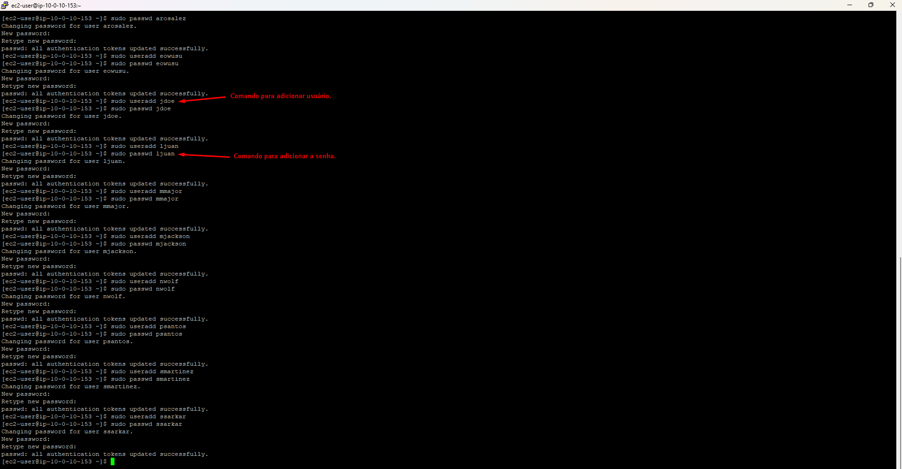
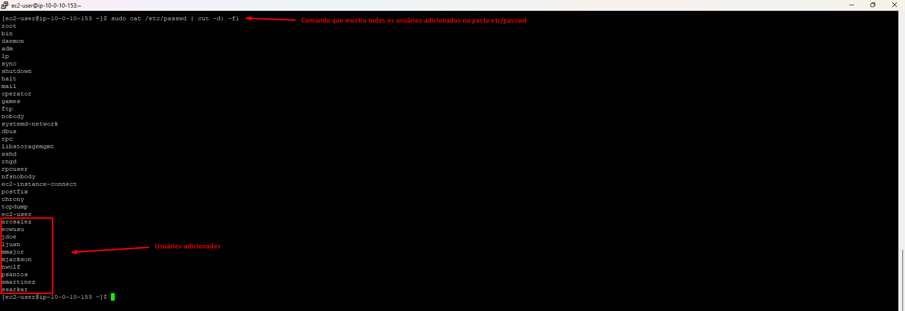
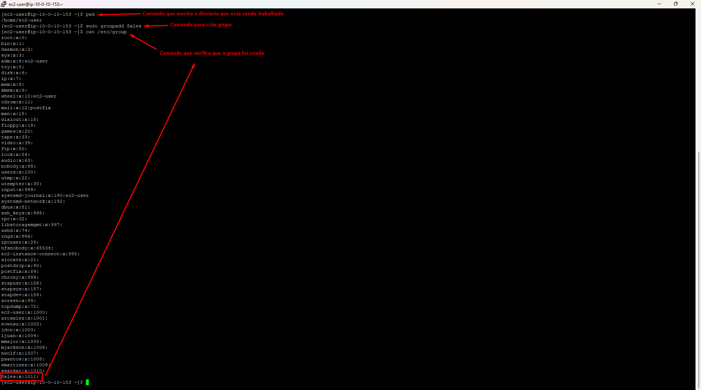
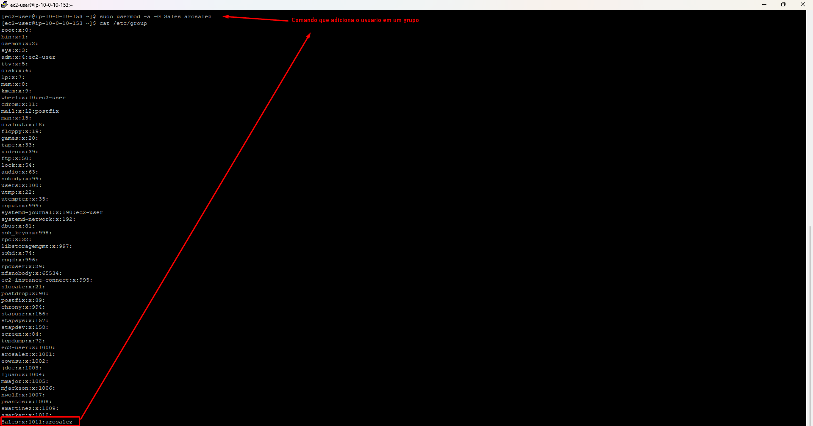
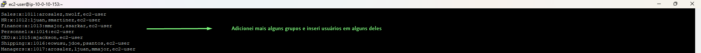
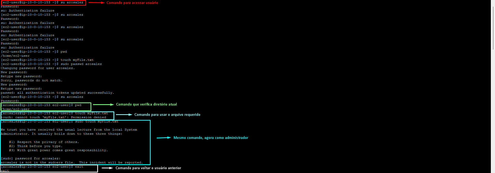
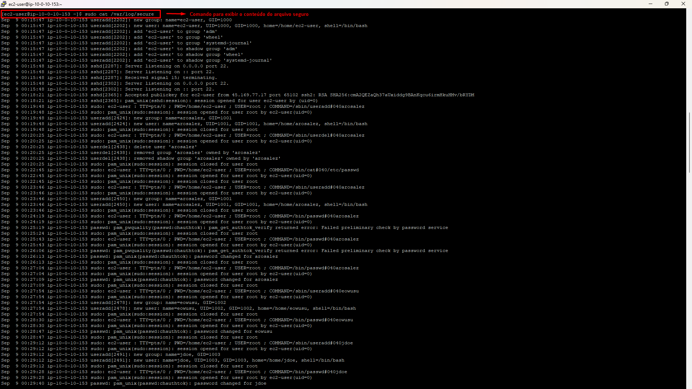
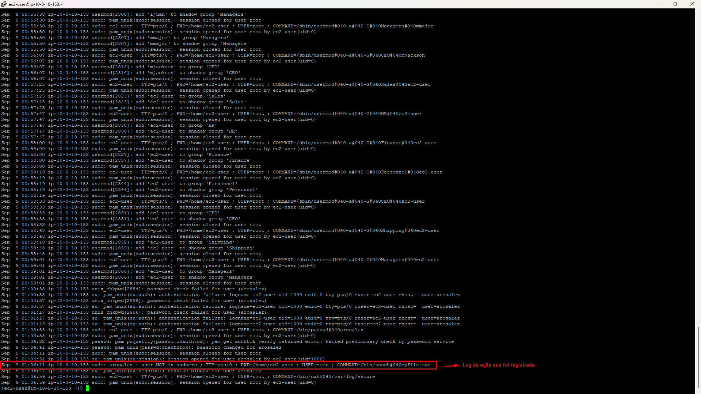

# 🪪📁 Gerenciando Usários e Grupos

Descubra como criar usuários e senhas, como acessar esses usuários e a criação de grupos.





- Autor: [moouraajv](https://github.com/moouraajv)


## 📌 Objetivos
- Criar novos usuários com senha padrão.
- Criar grupos e atribuir os usuários apropriados.
- Fazer login com usuários diferentes.


## 📝 Passo 1: Criar usuários
#### 1.1 - Validar se está na pasta inicial do usuário usando o comando (pwd).
```bash
  [ec2-user]$ pwd
  /home/ec2-user 
  [ec2-user]$
```

#### 1.2 - Para adicionar um usuário use o comando ```sudo useradd arosalez``` e em seguida presione Enter.
#### 1.3 - Para adicionar uma senha ao usuário use o comando ```sudo passwd arosalez``` e em seguida presione Enter.





#### 1.4 - Para validar que todos os usuários foram adicionados use o comando ```sudo cat /etc/passwd | cut -d: -f1```.





## 📝 Passo 2: Criar grupos
#### 2.1 - Validar se está na pasta inicial do usuário usando o comando (pwd).
```bash
  [ec2-user]$ pwd
  /home/ec2-user 
```

#### 2.2 - Para adicionar um usuário use o comando ```sudo groupadd Sales``` e em seguida presione Enter.
#### 2.3 - Para validar que o grupo foi criado use o comando ```cat /etc/group```.





## 📝 Passo 3: Adicionar usuários aos grupos
#### 3.1 - Para adicionar um usuário ao grupo use o comando ```sudo usermod -a -G Sales arosalez``` e pressione Enter.
#### 3.2 - Para verificar se o usuário foi adicionado use o comando ```cat /etc/group```.






## 📝 Passo 4: Fazendo login nos novos usuários
#### 4.1 - Entre com ```su arosalez```.
#### 4.1.2 - Depois entre com a senha que você definiu do usuário.
#### 4.1.3 - Agora você está logado no usuário arosalez.
```bash
  [arosalez@ec2-user]$
```
#### 4.2 - Use comando (pwd) para verificar o diretório atual.
```bash
  [ec2-user]$ pwd
  /home/ec2-user 
```
#### 4.3 - Use o comando ```touch myFile.txt``` em seguida você ira receber uma mensagem de permissão negada.
```bash
  [arosalez@ec2-user]$ touch myFile.txt
  touch: cannot touch ‘myFile.txt’: Permission denied
```
#### 4.3.1 - Esse erro ocorreu por causa que o usuário não tem permissão para alterar arquivos no diretório ec2-user.
#### 4.4 - Entre como administrador com o comando ```sudo```, digite ```sudo touch myFile.txt```.
#### 4.4.1 - Vai ser solicitado a senha novamente do usuário.
#### 4.4.2 - Vai aparecer uma nova mensagem que o usuário não está na lista de arquivos sudoers (usuários que possuem permissões especiais para executar comandos que exigem direitos de root).
```bash
  arosalez is not in the sudoers file.  This incident will be reported.
```
#### 4.5 - Agora use o comando ```exit``` para voltar ao usuário anterior ec2-user.





#### 4.6 - Use o comando ```sudo cat /var/log/secure``` para visualizar a log que vai exibir o conteúdo do arquivo seguro. use a seta para abaixo até achar a log.
```bash
  Aug  9 14:45:55 ip-10-0-10-217 sudo: arosalez : user NOT in sudoers ; TTY=pts/0 ; PWD=/home/ec2-user ; USER=root ; COMMAND=/bin/touch#040myFile.txt
```
#### 4.6.1 - Alguns detalhes da log podem aparecer difirentes.






## ✅ Conclusão

Neste laboratório, vimos como gerenciar usuários e grupos no Amazon Linux de forma prática:

- Criamos usuários e definimos senhas.
- Organizamos os usuários em grupos.
- Testamos permissões e entendemos as limitações de acesso.
- Exploramos logs do sistema para acompanhar atividades.

🔑 Esse processo é fundamental para administrar ambientes Linux com segurança e organização, garantindo que cada usuário tenha apenas as permissões necessárias. 